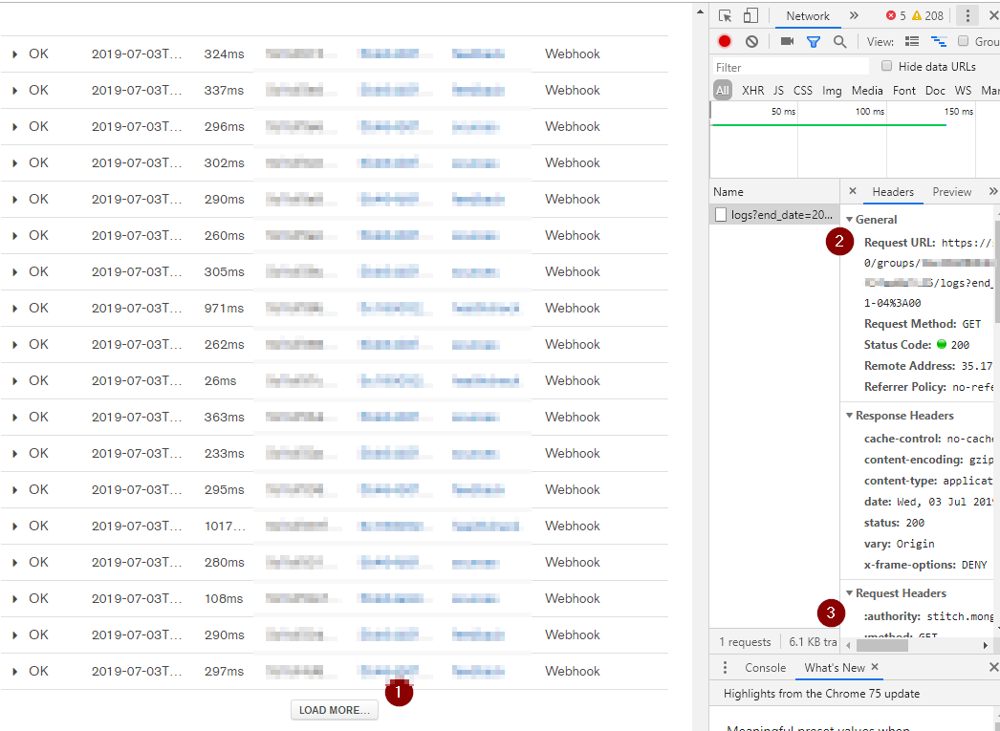
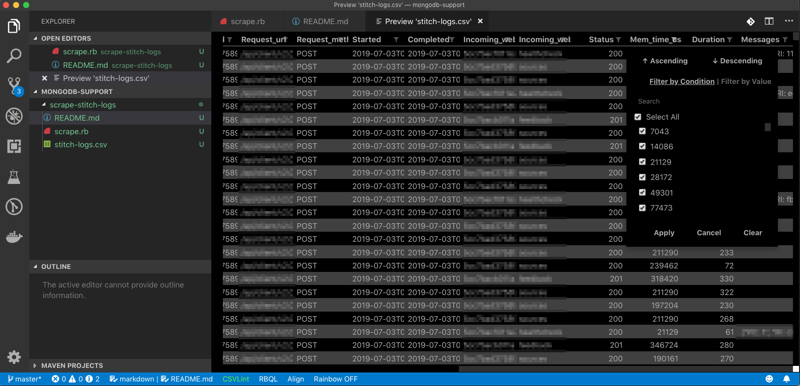

# Scrape MongoDB Stitch Logs

This is a Ruby script that can be used to download the Stitch logs for an application via the [Stitch Admin Logging APIs](https://docs.mongodb.com/stitch/admin/api/admin-v3/#logging-apis).

The output of this script is a CSV file.

## Setup

First navigate to your Application's logs page (ex: `https://stitch.mongodb.com/groups/{groupid}/apps/{appid}/logs`).

Next open a [developer console](https://support.airtable.com/hc/en-us/articles/232313848-How-to-open-the-developer-console) for your browser of choice.



(1) Click on the _Load More_ button and view the resulting call to the `/logs` endpoint in the developer console.

(2) From the full URL to the `/logs` endpoint as well as from the **authorization** value under Request Headers (3) make the following changes to the `scrape.rb` script:

```
STITCH_APP  = "{appid}"
ATLAS_GROUP = "{groupid}"
DATE_START  = "2019-07-02T00%3A00%3A00.000-04%3A00"
DATE_END    = "2019-07-03T00%3A00%3A00.000-04%3A00"
AUTH_TOKEN  = "Bearer xxxxxxxxxxx"
```

## Execution

Once the configuration values have been updated the script can be run by executing:

```bash
ruby scrape.rb
```

This will begin scraping logs from `DATE_END` and continue to scrape 100 entries at a time until `DATE_START` is reached.

The results will then be saved to `stitch-logs.csv`

## Previewing

If you're working with vscode there is an excellent extension called [Excel Preview](https://github.com/jjuback/gc-excelviewer). By right-clicking and selecting _Preview_ from the file browser in vscode a CSV file can be sorted and filtered.


